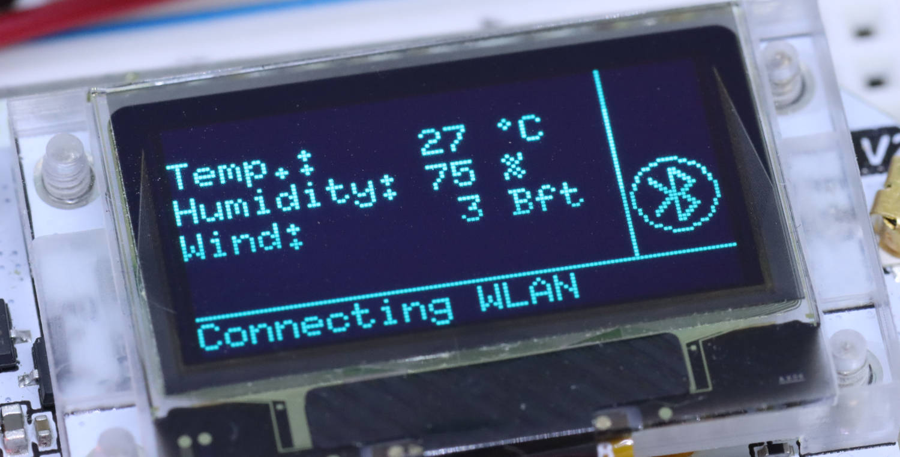
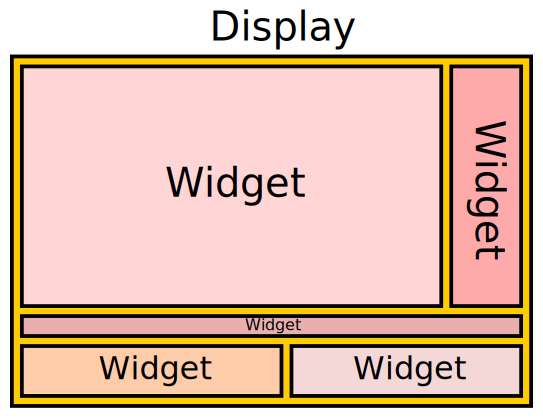
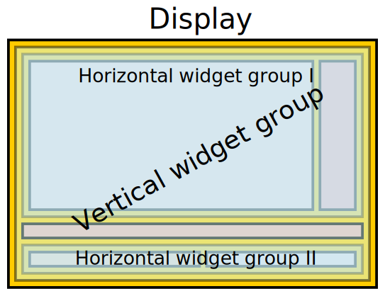
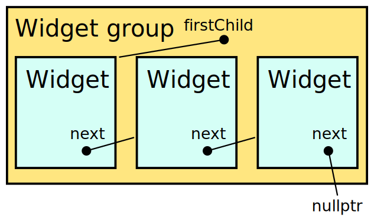
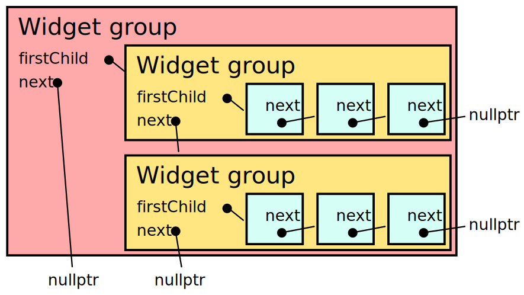
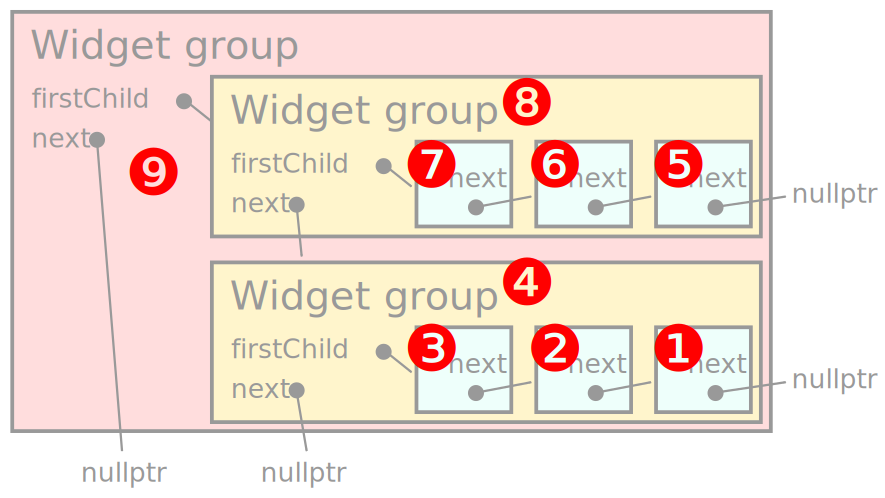
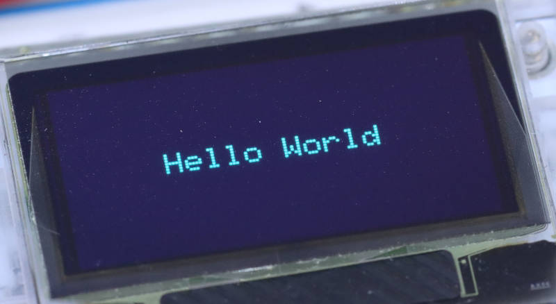
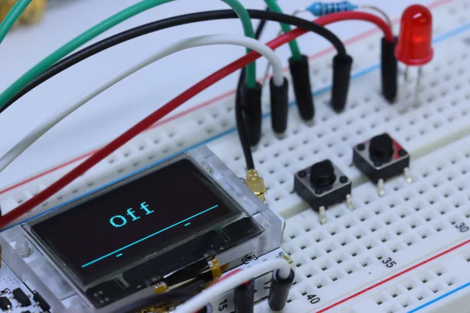
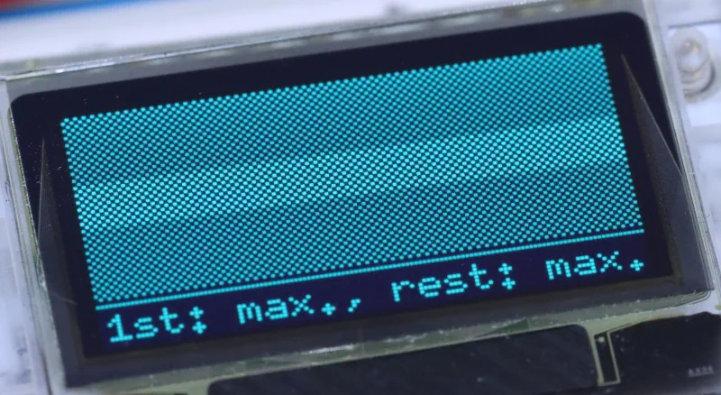
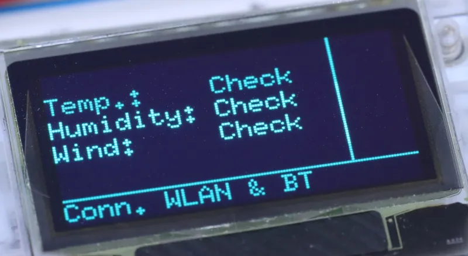

# UiUiUi user interface library



The UiUiUi user interface library allows designing user interfaces on typical tiny displays for micro controllers. It handles arranging and layouting of the interface elements and updating according portions of the display if an UI element changes its content. The interface is defined fully static; everything is done in the data segment of the program, no heap space and dynamic memory allocation is needed.

UiUiUi does _not_ implement hardware access directly, but relies on a low-level library for this. Currently, UiUiUi only works on top of [U8g2](https://github.com/olikraus/u8g2).

Please refer to the source code and [the source code documentation](doc/index.html) for detailed information.

## Introduction to UiUiUi

We start describing UiUiUi by giving an overview over its main concepts, the building blocks and the general work processes of the library.

### Widgets and widget groups

UiUiUi organizes an user interface on a display in _widgets_. A widget is always rectangular and shows itself on a certain area on the screen.


*Basic structure of an UiUiUi interface with widgets*

Widgets are arranged in all three dimensions:

1. They can be placed _next to_ each other from left to right.
2. They can be placed _above and below_ each other from top to bottom.
3. They can be _stacked_ on top of each other at the same place - where only one of them is actually shown.

For these arrangements, widgets must be combined in a _widget group_. A widget group is a widget itself, so it can also be arranged with other widgets or widget groups in a "higher level" widget group.


*Arranging widgets in widget groups*

With these simple mechanisms, arbitrary complex user interfaces can be designed.

### Purely static interface definition

A core concept of UiUiUi is the _static_ interface structure definition: Everything is defined at program startup and no heap space is needed.

Not having dynamic memory allocation might sound like a problem for a library which allows "widget groups" with an arbitary number of grouped widgets and an arbitrary depth of stacking the groups. UiUiUi solves the problem this way:

* Each widget has a `next` pointer which _can_ point to another widget. Widgets in one group are linked together this way in a linked list.
* Each widget group has a `firstChild` pointer which points to the first child widget in this group.


*Linked list of widgets in their widget group*

As widget groups are themselves widgets, they also have a `next` pointer _additionally_ to the `firstChild` pointer. Even mildly complex interfaces will almost always work with multiple widget groups on different layers.


*Widget group (red) with two enclosed widget groups (orange) with three widgets (cyan) each*

These pointers do _not_ point to objects on the heap, but to statically defined data in the data segment of the sketch. That means that the element pointed to must exist _before_ the pointer is created. That means that the order of definition of the widget is _reverse_ to the order of the tree:

* The last widget in a list is defined _first_.
* The innermost widget group is also defined _first_.

While that may sound complicated in the first place, it is not that difficult once you get used to it. We'll see it lateron in this documentation.


*Order of widget definition*


### Type definitions

UiUiUi is a C++-style library. The code is split into a number of classes. These classes are used for building the interface, presenting it on the display, and showing dynamic data during the runtime of the sketch. All classes of the UiUiUi library have the prefix "`UI`" in front of their class name.

You find the full source code documentation and refernce in the [source code documentation](https://dirkhillbrecht.github.io/UiUiUi/api/index.html). It is also available locally in the `docs/api` subdirectory.


#### Basic widgets

The basic widgets actually _show_ something on the screen. As the library is in its infancy, some important types may be still missing.

* `UITextLine` - One line of text of arbitrary length.
* `UITextIcon` - A text containing usually one character which is an icon.
* `UIBitmap` - An area showing a bitmap stored in XBMP format in the program.
* `UIHorizontalLine`, `UIVerticalLine` - A horizontal or vertical line of a certain width and a border with some width next to it.
* `UICheckerboard` - A single-pixel checkerboard pattern.

#### Decorating widgets

* `UIEnvelope` - An envelope contains exactly one widget and adds things like a border or certain layout preferences.

#### Widget groups

* `UIRows` - Organises widgets in rows from top to bottom.
* `UIColumns` - Organises widgets in columns from left to right.
* `UICards` - Organises widgets like a "stack of cards" on top of each other - where one card is selected to be shown and the other ones are invisible.

#### Other classes

The library also contains some organising and helper classes.

* `UIDisplay` - The topmost class representing the whole display.
* `UIPoint`, `UISize`, `UIArea` - Helper classes describing basic geometric entities.
* `UIParent` - Pure virtual class for classes which contain widgets.
* `UIExpansion` and `UIAlignment` are two enumerations which allow to describe layout details. They are both defined in `UIEnums.h`.


### Defining an UiUiUi interface

UiUiUi interfaces are defined _statically_ at the beginning of the sketch. That means

* The interface is defined outside `setup()` or `loop()`. Normally, its definition sits next to the low-level graphics definitions.
* The interface consists only of data structures in the data segment. No heap is needed.
* The interface structure does not change during runtime. Dynamics come in by changing widgets' contents, using `UICards` to change shown widgets etc.

The most simplistic interface definition could look like this:

```c++
UITextLine textLine=UITextLine(u8g2_font_6x10_tf);
UIDisplay display=UIDisplay(&textLine);
```

It defines one interface element, `textLine`, and places it in the display. Note how even in this most simple example the definition order "from inside outwards": You have to define the text line first as the display gets a pointer to it and you know the reference (`&textLine`) only _after_ the definition.

Let's say you want to have the text line surrounded by two horizontal lines above and below it. Then, your definition looks like this:

```c++
UIHorizontalLine lowerLine=UIHorizontalLine();
UITextLine textLine=UITextLine(u8g2_font_6x10_tf,&lowerLine);
UIHorizontalLine upperLine=UIHorizontalLine(&textLine);
UIRows surroundedTextLine=UIRows(&upperLine);
UIDisplay display=UIDisplay(&surroundedTextLine);
```

You start from bottom to top with the three widgets visible on the display (horizontal line, text line, other horizontal line), then group them with a `UIRows` group which will render them one below the other and put this `UIRows` as the topmost widget onto the display.

All these definitions do not mention _any_ coordinates where the widgets should be placed. That is due to the fact that UiUiUi figures out the widget placement on its own in the layout step.

### Layout step

Layouting means that each widget in the interface gets its actual location where it draws its content. This step is performed by UiUiUi during interface initialisation, i.e. after the interface has been defined but before it is rendered to the display for the first time.

The layout is generated in multiple steps.

1. Each widget has a _preferred size_ in width and height.
2. For both directions, the preferred size can either be a specific size in pixels or "as large as possible".
3. The preferred size of a widget group is derived from the widgets it contains.
4. `UIDisplay` triggers preferred size computation through the widget tree.
5. After that, `UIDisplay` calls the `layout()` method of the topmost wigdet.
6. Each widget group then will split the area it got from its caller among the widgets in its group - and call each of them with their portion of the area.
7. Each non-grouping widget will take the area it got for `layout()` and arrange its content appropriately.

The important thing is here: A widget must not assume that it gets an area of exactly the size it prefers. It could be any size! The size can be smaller than it requested - and for the request "as large as possible" this is the only possible outcome. But it can also be larger than requested and needed. In this case, the widget has to decide _where_ in that too large area it renders its content.

Different widgets have different defaults for aligning their content:

* `UITextLine` and `UITextIcon` render centralized in both directions.
* `UICheckerboard` renders itself always full-size.
* `UIHorizontalLine` and `UIVerticalLine` render their line full-length centered in their area.
* `UIRows` and `UIColums` start assigning areas always from the top-left corner.
* `UICards` passes the full area to the visible widget.

#### Layout rule adaptions with `UIEnvelope`

You can use `UIEnvelope` to influence these defaults. `UIEnvelope` takes an explicit expansion and alignment rule for its content.

Let's say you want to render two lines of text. The simple approach is this one:

```c++
UITextLine line2=UITextLine(u8g2_font_6x10_tf);
UITextLine line1=UITextLine(u8g2_font_6x10_tf,&line2);
UIRows lines=UIRows(&line1);
UIDisplay display=UIDisplay(&lines);
```

This will render the lines _at the top_ of the display as `UIRows` always starts rendering the widgets at the very top of its area.

To center the two lines, use `UIEnvelope`:

```c++
UITextLine line2=UITextLine(u8g2_font_6x10_tf);
UITextLine line1=UITextLine(u8g2_font_6x10_tf,&line2);
UIRows lines=UIRows(&line1);
UIEnvelope linesEnvelope=UIEnvelope(UIExpansion::Both,UIAlignment::Center,&lines);
UIDisplay display=UIDisplay(&linesEnvelope);
```

### Render step

Layouting is the _static_ setup of the display. Rendering is the _dynamic_ change of the display to show different content. UiUiUi splits the rendering process into two parts:

1. Any widget may detect that it _needs rendering_. A `UITextLine` detects this if its content is changed, e.g. by a call to `UITextLine::setText()`. Rendering needs are propagated upwards through the widget groups until they eventually reach `UIDisplay`.
2. Somehow, `UIDisplay::render()` is called. _Only then_ the widget's `render()` methods will also be called and the widgets finally get the chance to render themselves into the framebuffer abstracting from the actual hardware.

UiUiUi has two rendering modes:

1. In _forced rendering_ mode, `render()` is called for all widget groups and widgets. The widgets must render their complete content and update their complete area.
2. In _normal rendering_ mode, the widgets are free to render only parts of their area - or even nothing at all if nothing has changed. Additionally, parent widgets may decide to _not_ call `render()` of their child widgets at all if none of them has signalled a rendering need.

Normal rendering is the usual rendering mode. It is designed to be _fast_ and to do something only if it is really needed. If no widget has signalled a rendering need, `UIDisplay::render()` returns almost immediately.

If a widget renders some content into the framebuffer, it must return the coordinates of the altered area. This can be a subset of the whole widget's rendering area. UiUiUi unites all the changed areas of one rendering step and gets as result the portion of the display which actually needs to be updated.

### Display update

As just described, UiUiUi's rendering happens in the framebuffer of the hardware interface, _not_ at the hardware itself. An additional step is needed to actually make rendering results visible.

Here, UiUiUi builds upon the internal structures of the U8g2 library. It manages the framebuffer and has the method `U8G2::sendBuffer()` which sends the framebuffer to the actual display.

Sending the whole buffer can be quite inefficient, however. As the display are often connected via a serial interface, transmitting all the data needs a lot of time. And this time is especially lost if the content of the display has not changed.

Therefore, U8g2 allows to send only _parts_ of the framebuffer to the screen. U8g2 splits the framebuffer into tiles of 8*8 pixels which can be sent in any rectangular area. UiUiUi uses this scheme to cut the transmissions to the display down to those tiles which actually need to be updated.

To be able to do this, UiUiUi relies on the widgets to report the actually `render()`ed area back. `UIDisplay` then converts this into tile ranges and sends only these tiles to the display.

This concept goes even further. One key feature of UiUiUi is that it can be used in event-driven programs and time-sliced task multiplexing. Here it is crucial that one task does not work for too long before control goes back to the time multiplexer. Therefore, the maximum number of tiles sent at once to the display can be restricted.

If the number of tiles that needs to be sent to the display exceeds the number of tiles allowed to be sent to the display in one chunk, sending will be split into parts and each call to `UIDisplay::render()` will only send one part of the tiles to be updated until all tiles have been sent.

In restricted-tiles mode, UiUiUi strictly seperates tile updates from widget rendering. As long as there are untransmitted tiles, `UIDisplay::render()` will send these and _not_ call `render()` of any widgets, even if they signalled a rendering need.

Tile restrictions can be set, reset, or changed during runtime. You may allow complete or large display updates when your sketch does not perform any time-critical operations and restrict updates if timing is important. You can even switch off updating completely with `UIDisplay::deactivate()`.  While this will still finish transmission of any outstanding tiles to the display, no new `render()` operations will start until `UIDisplay::activate()` is called.


## Usage

We have now seen the basic concepts and structures of UiUiUi. We also dived into the internal mechanisms. Time to bring it together and describe how to actually use the library.

You may be interested in the [example programs](#example-programs). They are described in another section further below in this document - and of course you may have a look into the source code.

Of course, you have to download UiUiUi before you can use it. UiUiUi is available through the Arduino library manager. You can also simply clone the repository from Github.

### Dependency on display hardware library

UiUiUi does not render content itself to the display hardware. As it only supports U8g2 as underlying hardware access library, that library must be included and initialized as usual at the beginning of the sketch. You must also call `U8G2::begin()` yourself before using UiUiUi.

The minimum U8g2 initialisation code needed to work with UiUiUi on top of it looks like this:

```c++
#include <U8g2lib.h>

U8G2_whatever_device u8g2(U8G2_R0,...);

void setup() {
  u8g2.begin();

  // now you can initialize the UiUiUi components
  displayManager.init(&u8g2);
}
```

### Includes

UiUiUi itself comes as a number of C++ classes. All these classes are written in full `.h`/`.cpp` source code file pairs. It is possible to include only the `.h` files for the widgets you actually need.

However, there is also an all-encapsulating include file `UiUiUi.h` which simply includes the whole library. That could make life easier, especially during development.

Of course, all include files are protected against multiple evaluation. We use the modern `#pragma once` clause instead of `#IFNDEF`/`#DEFINE`/`#ENDIF` lines.

The include section for a UiUiUi-using sketch could therefore look like this:

```c++
#include <UITextLine.h>
#include <UIRows.h>
#include <UIDisplay.h>
```

...but it could also be as simple as

```c++
#include <UiUiUi.h>
```

### Definition and the `setup()` code

We have already described how to [define an UiUiUi interface](#defining-an-uiuiui-interface) further upward in this documentation. In short:

* You define the widgets and all their connections statically at the beginning of the sketch.
* Widgets must be defined before they can be referenced.
* Definitions of widget groups the their grouped widgets will therefore be ordered from end to beginning and from inner to outer layers.

In the `setup()` function of the sketch, you initialize the UiUiUi interface and usually you will also perform the initial rendering. As everything has to be drawn, this will usually be a _forced rendering_.

A typical initialisation scheme for UiUiUi can look like this:

```c++
#include <U8g2lib.h>
#include <UiUiUi.h>

U8G2_whatever_device u8g2(U8G2_R0,...);

UITextLine textLine=UITextLine(u8g2_font_6x10_tf);
UIDisplay display=UIDisplay(&textLine);

void setup() {
  u8g2.begin();
  display.init(&u8g2);
}
```

After this, the whole display part of the sketch is initialized and ready to use. Note that this particular code will show _nothing_ on screen as the `textLine` does not have any content.

You _can_ start updating the interface contents even _before_ the display has been initialized. E.g. the following `setup()` extension from the code above is valid:

```c++
void setup() {
  u8g2.begin();
  textLine.setText("Hello world");
  display.init(&u8g2);
}
```

This will render the text "Hello world" on the screen and is more or less the code of the [HelloWorld](#helloworld) example sketch.

You also may want to initialize UiUiUi but delay the initial rendering after some data has been set to the widgets. In this case, you can call `UIDisplay::init()` so that it does _not_ perform the initial forced rendering. However, than you must do that on your own when your code is ready. The code above can also be written this way:

```c++
void setup() {
  u8g2.begin();
  display.init(&u8g2,true,false);
  textLine.setText("Hello world");
  display.render(&u8g2,true);
}
```

Working this way may be needed if widgets need the initial preferred size computation before they can handle input. Currently, that's not the case for any of the available widget types.

### Usage in `loop()`/`delay()` sketches

The default way of programming simple Arduino sketches is by having a `loop()` function which somewhere (often at the end) calls `delay()` to postpone the next call. The overall scheme looks like this:

```c++
loop() {
    // do something, call other functions etc.
    delay(some_time);
}
```

UiUiUi works well in such a setup. You simply update the content of the widgets any way you like and call `render()` at the end:

```c++
bool flag;

loop() {
    flag=!flag;
    textLine.setText(flag?"Yes":"No");
    display.render();
    delay(2000);
}
```

You may call `UIDisplay::render()` even if nothing really changed as it returns _very_ quickly if nothing has to be done.

The [SimpleTimerLoop](#simpletimerloop) example program shows this approach. [CheckerboardCycle](#checkerboardcycle) also works this way, but that example also shows the limitations of this concept: `loop()` runs for quite a long time in this example and calls `delay()` at multiple occasions. And every time `delay()` is called, nothing else can happen.

### Short introduction to event-driven sketches

UiUiUi allows the design of rather complex interfaces. Typically, they are needed for rather complex sketches. And those sketches typically follow an event-driven approach: Functions are not called from within `loop()`, but by some background service. In `loop()`, only the managing function of this background service is called.

While this document is _not_ meant as a general documentation on event-driven sketches, I'd like to show the overall scheme of such sketches when using the [TaskManagerIO](https://github.com/davetcc/TaskManagerIO) library:

```c++
#include <TaskManagerIO.h>

void doSomething() {
    // this code performs some action
}

int actionTaskId;

void setup() {
  actionTaskId=taskManager.scheduleFixedRate(1000, [] {
    doSomething();
  });
}

void loop() {
  taskManager.runLoop();
}

```

In this sketch, `doSomething()` is called roughly once per second (`1000` milliseconds between calls in the `scheduledFixedRate()` call). Of course, a simple `loop()` has the same result:

```c++
loop() {
    doSomething();
    delay(1000);
}
```

But things get complicated if there is _more than one_ thing to do:

```c++
#include <TaskManagerIO.h>

void doSomething() {
    // this code performs some action
}

void doSomethingElse() {
    // this code performs some other action
}

int actionTask1Id,actionTask2Id;

void setup() {
  actionTask1Id=taskManager.scheduleFixedRate(1000, [] {
    doSomething();
  });
  actionTask2Id=taskManager.scheduleFixedRate(650, [] {
    doSomethingElse();
  });
}

void loop() {
  taskManager.runLoop();
}
```

Now, the two methods `doSomething()` and `doSomethingElse()` are called every 1000 and every 650 milliseconds - and there is no way how you can model this simply with `loop()` and `delay()`.

### UiUiUi in event-driven sketches

UiUiUi fits very well into event-driven sketches. The usual approach is to setup a regular schedule for `UIDisplay::render()` calls - and you're done:

```c++
#include <TaskManagerIO.h>
#include <U8g2lib.h>
#include <UiUiUi.h>

U8G2_whatever_device u8g2(U8G2_R0,...);

// define the interface, finally having
UIDisplay display=UIDisplay(&someWidget);

int renderTaskId,actionTaskId;

void doSomething() {
    // perform some operations
    textWidget.setText(...); // make changes to the interface
    cardWidget.setVisibleWidget(...);
    ...
    // NO CALL TO render()!
}

void setup() {
  u8g2.begin();
  display.init(&u8g2);

  renderTaskId = taskManager.scheduleFixedRate(80, [] {
    display.render(&u8g2);
  });

  actionTaskId = taskManager.scheduleFixedRate(50, [] {
    doSomething();
  });
}

void loop() {
  taskManager.runLoop();
}
```

After initializing everything, you just start a regular render task which renders any changes onto the display which have happened since the last rendering. It is no problem to call this method often and even if nothing has changed, as it returns _very quickly_ if there is nothing to do.

This setup makes it also very easy to apply a restriction on the number of tiles transferred in one transmission. Only add one line in `setup()`:

```c++
void setup() {
  u8g2.begin();
  display.init(&u8g2);
  display.setUpdateTiles(6,20);

  renderTaskId = taskManager.scheduleFixedRate(80, [] {
    display.render(&u8g2);
  });
  [...]
```

With this addition, UiUiUi will not send more than six tiles if some rendering has taken place in the call to `render()` ("first run") and not more than 20 tiles if only the tile transmission happens in `render()` ("follow runs"). This will, of course, slow down the rendering overall, but each run of `UIDisplay::render()` will stay within a certain time frame (depending on your hardware), so that you can much better control how long the gaps between calls to actual business login functions in the cooperative scheduling setup are.

The [SimpleTimerTask](#simpletimertask) example program is the most simple example showing how this can be used. The most complex example is [MockWeatherStation](#mockweatherstation) which runs several asynchronous tasks which update different parts of the display.

----

And with this - we're done! Now you know everything you need to use UiUiUi. The following sections dive - among other things - a bit deeper into the examples, the concepts of the library and some possible extension paths for the future.

## Example programs

UiUiUi comes with a number of example programs. All of them need a display which is supported by by U8g2. The included code has been developed on a Heltec ESP 32 Lora board with an on-board SSD1306-OLED display with 128*64 pixels. You will almost surely have to change the U8G2 hardware description if you have another hardware.

Some example programs need two external buttons and an LED. Check the pin definition in those sketches and adapt them appropriately.

### HelloWorld

The most simple sketch just writes "Hello World" on the display. It really does nothing more.



### EnvelopeAroundChecker

This sketch shows how to draw a border around a widget using `UIEnvelope`. It also only generates the interface and renders it once on the display without any further actions or interaction.

### SimpleTimerLoop

This is the first sketch which actually performs some action on the display. It shows the time since the last boot of the device and updates the screen content every second.

### SimpleTimerTask

This sketch does exactly the same as SimpleTimerLoop, but uses an event-driven approach with the TaskManagerIO library.

### RotatedDisplay

This sketch is also derived from SimpleTimerLoop and shows that UiUiUi can also handle rotated display orientations.

### Bitmap

A bitmap is drawn four times on the screen and cycled through two different alignments.

### ButtonsAndLED

Two buttons are used to switch an LED on and off. The LED state is dubbed by an "On"/"Off" message on the display. Additionally, two small indicators in a status line at the bottom of the display indicate whether one of the buttons is just pressed.



### CheckerboardCycle

A non-interactive demonstration how tile restriction affects rendering. Just sit and watch.



### CheckerboardAndButtons

Very similar to ButtonsAndLED, but instead of a label, a screen-filling checkerboard is switched on and off in sync with the LED. Use this to explore the responsibility of the sketch to incoming events (button strokes) with different tile restriction settings.

### EnvelopedCheckerboardAndButtons

As CheckerboardAndButtons, but with the border of EnvelopeAroundChecker. This has a slightly more complicated interface definitions and shows how rendering needs are propagated through the widget layers.

### MockWeatherStation

This is the most complex example interface: A weather station which shows some weather data in two flavours. Additionally, it has some Wifi and Bluetooth connection. Weather data is regulary updated and unfortunately Wifi and Bluetooth connection break down steadily so that all indicators on the display are permanently changing. This all happens event-driven.



Note that the weather data and all "connections" are completely mocked. The sketch is only about the interface.

## Important concepts

UiUiUi is developed with some basic concepts in mind. They are explained and discussed in this section.

### Data-segment only, no heap space used

Dynamic memory allocation with `malloc()` or the C++ `new` operator is a very common scheme to get memory space to work in. However, in sketches on microcontrollers, such code is notorious for breaking in the long run. Possible reasons are mistakes in memory management or memory fragmentation.

UiUiUi therefore refrains completely from this kind of memory management. All data structures for the user interface are declared statically and do not change during runtime. For something rather dynamic like a user interface, this approach has some challenges. But it prevents lots of problems.

The key design choice here is to split references in a way that no unpredictable amount of pointers is needed in the data structures. Instead, each ordinary `UIWidget` has _one_ pointer: The `*next` widget. For `UIWidgetGroup`s, a second pointer to the `*firstChild` is added. These two pointers allow arbitrary complex user interface definitions completely without heap space. The only shortcoming is that a widget group cannot access each of its grouped widgets directly, but there is actually no need for it. The only exception is `UICards`: It needs to know which of its widgets it should render - and for that, a special pointer `*visibleWidget` is added.

### Simple widgets and combination over capability

UiUiUi is a microcontroller library. While these devices have remarkable capabilities these days, a library for such a platform should be careful with resources. Therefore, UiUiUi widgets try to be _lean_ and not duplicate functions.

E.g. typical user interfaces allow to make widgets temporarily invisible. Some `UIWidget::setVisible()` method seems feasible. But `UICards` can be used very well to make widgets invisible: setting the visible widget to `nullptr` leaves the area blank. As most widgets in the typical interface do _not_ need this invisibility switch, it is cheaper to put those which _do_ need it into a `UICards` and control their visibility this way.

### Modern C++

This library has started in 2022. It uses at least relatively modern C++ idioms like `#pragma once` instead of `#IFNDEF _LIBNAME_H` or `static const` instead of `#DEFINE`.


## Extension plans

UiUiUi is a quite young library (at least at the time I write this documentation). There is a number of possible extension paths I'd like to mention here

### More widget types

The current set of widgets is still quite limited. Some useful extensions can be:

* A progress bar which shows the progress of some operation. If it changes its setting gradually, it would be possible to render it extremly efficient by updating only the tiles of the framebuffer where the bar actually has changed. `UITextLine` performs similar computations on text updates.

* Some kind of a time scale display where the development of some parameter is shown over the time. This would be a truly areal widget which uses its whole area for displaying a graph.

* A knob dubbing actions on a rotating input device.

### Complex widgets

So far, UiUiUi widgets are very basic. It could make sense to define more complex widgets as combination of some simpler ones:

* A border around a widget. Some example sketches implement this with two horizontal and two vertical lines. I have also thought about adding this capability to `UIEnvelope`, but the reflections about [combination over capabilities](#simple-widgets-and-combination-over-capability) speak against this idea.
* Message boxes with the well-known "OK" or "Cancel" buttons. To me it's not totally clear, though, if this makes really sense on the tiny displays UiUiUi is aimed at.
* A menu system. This could make sense for initial configuration steps when even network connections are not working (or the device operates without network access). The menu could somehow consist of multiple `UITextLine` widgets. The complete menu structure would be given in one static data storage - either a tree of submenus and menu items or some textual representation which is evaluated on the fly. Callbacks trigger actions if certain menu items are selected.

### More hardware libraries

Currently, UiUiUi is exclusively bound to U8g2. While this is a very capable library with exceptional font support, there are other libraries which seem to fit better for some types of hardware, e.g. e-paper displays. Also, U8g2 does not support multi-color displays.

Hopefully, UiUiUi does not rely too deep on U8g2-exclusive features. It might be possible to define a small abstraction layer, perhaps even as macros, to make UiUiUi compatible with other graphics hardware libraries. The core features, namely layout processing, render management and partial display updates, work conceptually totally independent of U8g2 and should be useable with other libraries, too.

### Structural changes and enhancements

UiUiUi may have some structural shortcomings which should be resolved once the library becomes more mature. Possible items to evaluate:

* Preferred size computation is actually performed in the `init()` step. It might be possible to perform this computation during initialisation of the interface data structures. Currently, this code seems a bit "clumsy".
* Perhaps the widget management could become a bit more dynamic. There is no real obstacle preventing multiple calls to `layout()`, it simply does not make any sense currently as preferred sizes and general arrangement never change - and therefore the layout would not change, either.
* Rendering always results in _one_ rectangle to be updated on the display. If this is the result of two smaller areas on opposite positions on the display, lots of superfluous tiles are sent to the display. The information about the distinct areas to be updated could be retained during the rendering process, e.g. by having `UIUpdateDimension` instances which form a linked list. Then, the display update step can combine these areas so that only the really needed parts are transferred.
* The U8g2 data structure is currently passed by reference to `UIDisplay::init()`, `::layout()` and `::render()`. Perhaps it is also possible to pass it by value? Furthermore, could it be sensible to store the U8g2 reference (or value) directly in `UIDisplay` instead of passing it around each time? I am currently not sure about this.

### Widget overlays

A very basic design decision of UiUiUi is that widgets _do not overlap_. However, this makes rendering certain interface designs difficult. It could be possible to define a `UICards` derivate, say `UIOverlay`, which does not render only one of its group members, but an additional widget (group) "on top" of it.

This extension would need a slightly more sophisticated approach to rendering: Rendering requirements of one widget may raise a rendering requirement for another totally unrelated widget as one of them overlays the other. The solution could be a "partial forced rendering": The `forced` parameter of `render()` becomes a `UIArea forcedArea` and widgets must render themselves if they overlap this area. Then, `UIOverlay` could force-render the render-unaffected of the two widgets with this partial force rendering. More work would be needed to manage the actually required rendering areas.

### `print()` implementation

The U8g2 handlers implement the `Print` interface. It allows to print all types of variables as easy as with `Serial`. UiUiUi doens't do that. Assuming there was a `UIMultiTextLine` widget (probably consisting of `UITextLine`s), that one could implement some row-break algorithms for long strings and finally also a `print()`/`println()` method.

### Generalisation away from Arduino IDE

The UiUiUi library is currently developed within the Arduino ecosystem. It could be used in other ecosystems and could be embedded into other library managers (e.g. PlatformIO). However, somewhere a starting point had to be made - and Arduino it was.

## Trivia

### The library's name

Why is it called "UiUiUi"? Well, "UI" is the abbreviation of "user interface" - and that's what this library is about. So, a name with "UI" seems rather natural. "Uiui" feels a bit difficult to pronounce. But "Uiuiui" - or "UiUiUi" - works pretty well.

And finally, "Ui ui ui" was the catchphrase of "Samson", one of the puppets of the German "Sesame Street" of the late 1970ies and 1980ies when I was a child and watched it almost every evening.

So, after all, there are not many names more natural than "UiUiUi" for this library, aren't they?

### The author

I write software since the mid-1980ies, mainly Turbo Pascal and, since about 1995, Java. I have some experience in C and in Arduino programming. But this is my first larger C++ project. Of course, I have quite an understanding of object-oriented programming in Java but C++ is a different story. Having "objects" on the data segment is something simply not possible in Java and it took me some time to actually understand the memory model behind all this.

I want to develop small appliances and gadgets using microcontrollers like the ESP32. I like the idea of having a small display at the device, but I did not find a library to control the display the way I want. So I started writing my own. Voila: UiUiUi.

### Development environment

I program using the Arduino IDE 2.2.1 (after starting in the old 1.8 series). The UiUiUi source code is loaded in an external editor and project and linked symbolically into the Arduino sketchbook's library section.

I have used the Heltec Wifi Lora ESP32 module with on-board SSD1306 OLED display. So far, this is my only development environment. I have access to an Arduino ATMega 2560, but no display to connect it to. I'd like to test this whole stuff together with an e-paper display.

For the first weeks, I used [WokWi](https://wokwi.com/) to develop the most basic structures. The free version is not really suitable for library development, so when the basics were in place, I switched to a local environment and "real hardware".

### API documentation generation

The API documentation is generated with [Doxygen](https://www.doxygen.nl/). A configuration file exists so you can recreate the complete documentation using `doxygen doxygen.conf` on the command line in the project's main directory.

The API documentation is stored in a location where it can be addressed by the Github pages mechanism. Currently, it is _not_ generated by a Github action but generated locally and stored in the repository.

## Version history

| Version | Date | Main changes
|:--:|:--:|:--
| 0.9.0 | 2022‑10‑03 | Initial public release. UiUiUi is already used in projects, so it's pretty close to its 1.0 release.
| 0.9.1 | 2023-10-15 | U8g2's display orientation feature supported, minor bugfixes in example programs
| 0.9.2 | 2023-10-19 | UIBitmap widget, Fixes to UIEnvelope and UI line widgets, API documentation moved
